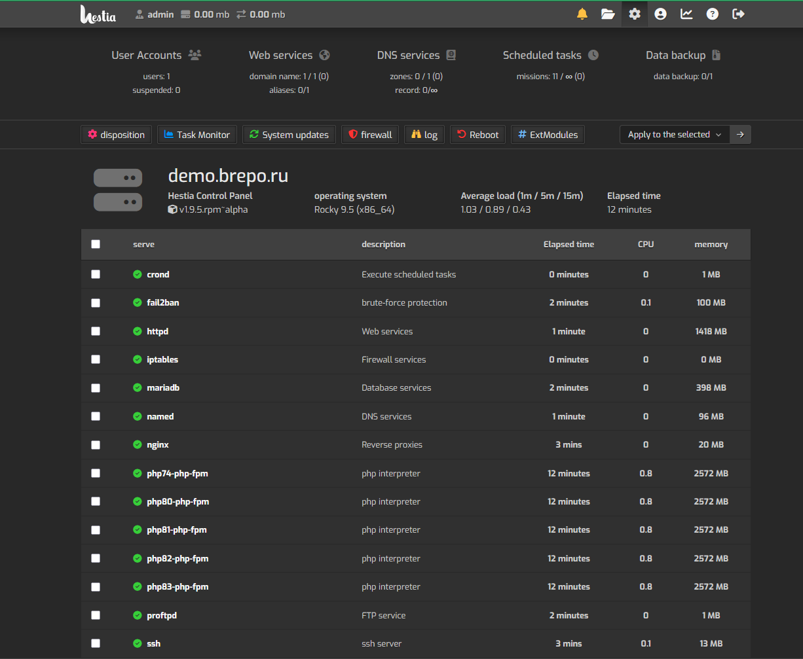

<div align="center">

# [Hestia 控制面板 (RPM 版)](https://hestiadocs.brepo.ru)



## 面向现代网络托管环境的轻量级强大服务器控制面板

**稳定版本:** 1.9.5 (RPM) |
[RPM 版](https://hestiadocs.brepo.ru) |
[原版 Ubuntu/Debian 项目](https://hestiacp.com) |
[更新日志](/CHANGELOG.md) |
[支持论坛](https://forum.hestiacp.com)
<br>
[](https://drone.hestiacp.com/hestiacp/hestiacp)
[](https://github.com/hestiacp/hestiacp/actions/workflows/lint.yml)
[](https://gurubase.io/g/hestia)

</div>

Hestia 控制面板（RPM 版）由专注于RHEL系列发行版的独立团队维护开发。由于从原项目分叉后，此版本已包含与上游 Ubuntu/Debian 版本无法直接同步的变更（部分功能不适用于 RPM 系统），因此相关问题请直接报告至本项目。

以下是面板的通用描述。

## **欢迎使用！**

Hestia 控制面板旨在通过集中式面板为管理员提供易用的网页界面和命令行工具，快速部署和管理网站域名、邮箱账户、DNS 区域和数据库，无需手动配置独立组件。

## 功能与服务

- Apache2 和 NGINX 搭配 PHP-FPM
- 多版本 PHP 支持（7.4[EOL](https://www.php.net/supported-versions.php) - 8.3，默认 8.2 来自 Remi 仓库 + 自定义 PHP 构建）
- DNS 服务器（Bind）
- 带病毒/垃圾邮件防护的邮件服务及网页邮箱（POP/IMAP/SMTP，ClamAV，SpamAssassin，Sieve，Roundcube）
- MariaDB/MySQL 和 PostgreSQL 数据库
- Let's Encrypt SSL 支持
- 防火墙含暴力破解防护和 IP 管理（iptables，fail2ban，ipset）

## 支持系统

- **MSVSphere:** 9
- **AlmaLinux:** 9
- **RockyLinux:** 9

**注意事项:**

- HestiaCP 不支持 32 位操作系统！
- 在 OpenVZ 7 或更早版本上使用 HestiaCP 可能出现 DNS/防火墙问题。建议选择基于 KVM/LXC 的虚拟化方案。

## 安装 Hestia 控制面板

- **注意:** 为保证功能完整性，请在新装系统上进行安装。

尽管我们力求安装过程简单直观，但使用者需具备基础的 Linux 服务器配置知识。

### 步骤 1：登录

使用 **root** 或超级用户权限通过 SSH 登录：

```bash
ssh root@your.server
```

### 步骤 2：下载

获取最新安装脚本：

```bash
wget https://dev.brepo.ru/bayrepo/hestiacp/raw/branch/master/install/hst-install.sh
```

### 步骤 3：执行

运行脚本并遵循屏幕指引：

```bash
bash hst-install.sh
```

安装完成后，您将收到欢迎邮件（如配置）和登录信息。

### 自定义安装

使用参数选择组件，查看选项：

```bash
bash hst-install.sh -h
```

## 更新现有安装

默认启用自动更新（通过 **服务器设置 > 更新** 管理）。手动更新：

```bash
dnf update
```

## 问题与支持

- RPM 版本问题反馈：[提交 GitHub Issue](https://github.com/bayrepo/hestiacp-rpm/issues)
- 原版 Debian/Ubuntu 版本：[原项目仓库](https://github.com/hestiacp/hestiacp)

## 版权声明

原始版权归属 [HestiaCP](https://github.com/hestiacp/hestiacp)

## 授权协议

Hestia 控制面板遵循 [GPL v3](https://github.com/hestiacp/hestiacp/blob/release/LICENSE) 协议，基于 [VestaCP](https://vestacp.com/) 开发。
